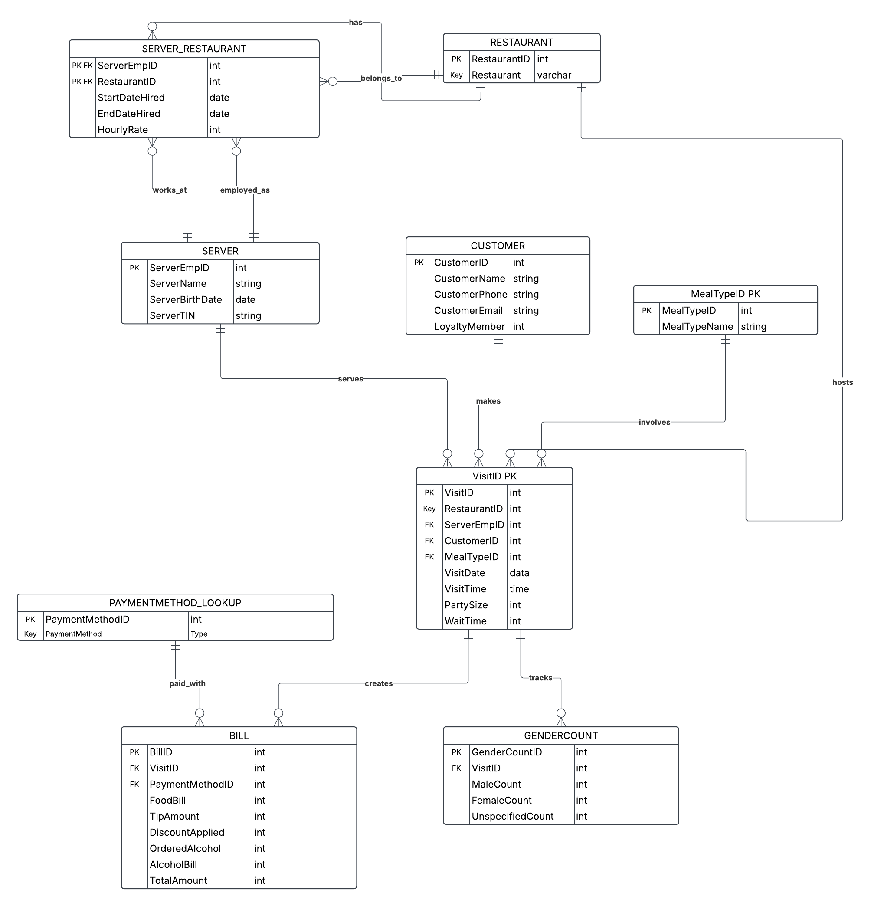

## **1. Functional Dependencies**
The following functional dependencies exist in our dataset:

\[
\text{RestaurantName} \rightarrow \text{RestaurantID}
\]

\[
\text{CustomerEmail} \rightarrow \text{CustomerID, CustomerName, CustomerPhone, LoyaltyMember}
\]

\[
\text{ServerEmpID} \rightarrow \text{ServerName, ServerBirthDate, ServerTIN}
\]

\[
\text{VisitID} \rightarrow \text{RestaurantID, CustomerID, ServerEmpID, VisitDate, VisitTime, PartySize, MealTypeID, WaitTime}
\]

\[
\text{VisitID} \rightarrow \text{BillID, PaymentMethodID, FoodBill, AlcoholBill, TipAmount, DiscountApplied, OrderedAlcohol, TotalAmount}
\]

\[
\text{PaymentMethodID} \rightarrow \text{PaymentMethod}
\]

\[
\text{MealTypeID} \rightarrow \text{MealTypeName}
\]

\[
\text{GenderCountID} \rightarrow \text{MaleCount, FemaleCount, UnspecifiedCount}
\]

---

## **2. Normalization to 3NF**
To remove redundancy and ensure efficiency, the schema is decomposed into the following tables:

- **RESTAURANT (RestaurantID, RestaurantName)**
- **CUSTOMER (CustomerID, CustomerName, CustomerPhone, CustomerEmail, LoyaltyMember)**
- **SERVER (ServerEmpID, ServerName, ServerBirthDate, ServerTIN)**
- **VISIT (VisitID, RestaurantID, ServerEmpID, CustomerID, MealTypeID, VisitDate, VisitTime, PartySize, WaitTime)**
- **PAYMENTMETHOD_LOOKUP (PaymentMethodID, PaymentMethod)**
- **BILL (BillID, VisitID, PaymentMethodID, FoodBill, AlcoholBill, TipAmount, DiscountApplied, OrderedAlcohol, TotalAmount)**
- **SERVER_RESTAURANT (ServerEmpID, RestaurantID, StartDateHired, EndDateHired, HourlyRate)**
- **MEALTYPE (MealTypeID, MealTypeName)**
- **GENDERCOUNT (GenderCountID, VisitID, MaleCount, FemaleCount, UnspecifiedCount)**

---

## **3. Normalization Process**
### **1st Normal Form (1NF)**
- Ensures all values are **atomic** (no multi-valued attributes).
- Removed repeating groups from the data.

### **2nd Normal Form (2NF)**
- Removed **partial dependencies** by ensuring each **non-key attribute depends on the entire primary key**.
- Separated **restaurant details, customers, servers, and payments** into their own tables.

### **3rd Normal Form (3NF)**
- Removed **transitive dependencies** (attributes that don’t depend directly on the primary key).
- Ensured that:
  - `ServerEmpID` in `SERVER_RESTAURANT` links to both `SERVER` and `RESTAURANT`.
  - `VisitID` in `BILL` links to a unique `VISIT`.
  - `CustomerEmail` acts as a unique identifier for **customers**.

---

## **4. Entity Relationship Diagram (ERD)**
The following diagram represents the relationships between entities in the schema:

```{r, echo=FALSE, out.width="90%", fig.cap="Entity-Relationship Diagram"}

